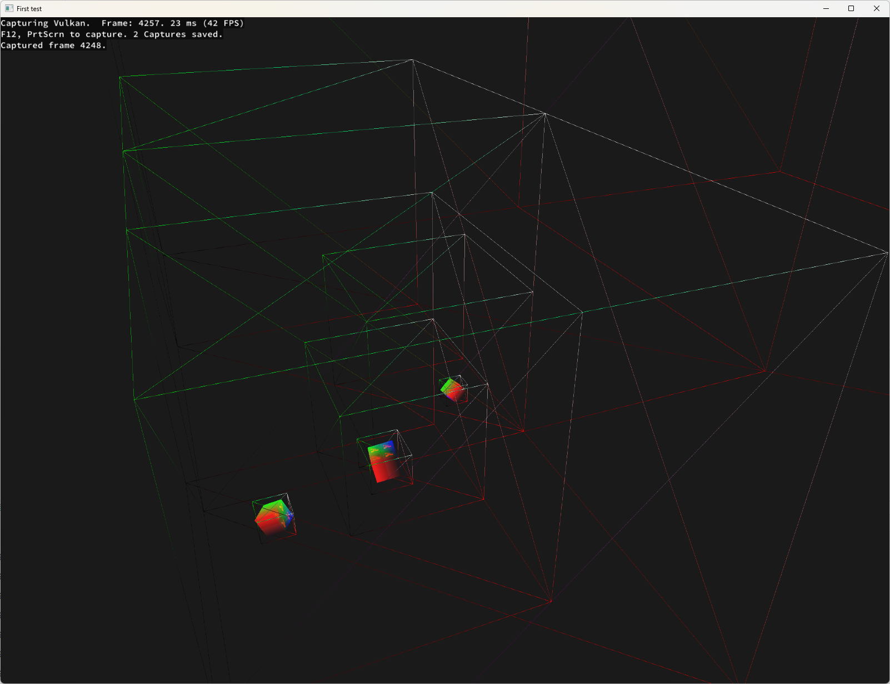
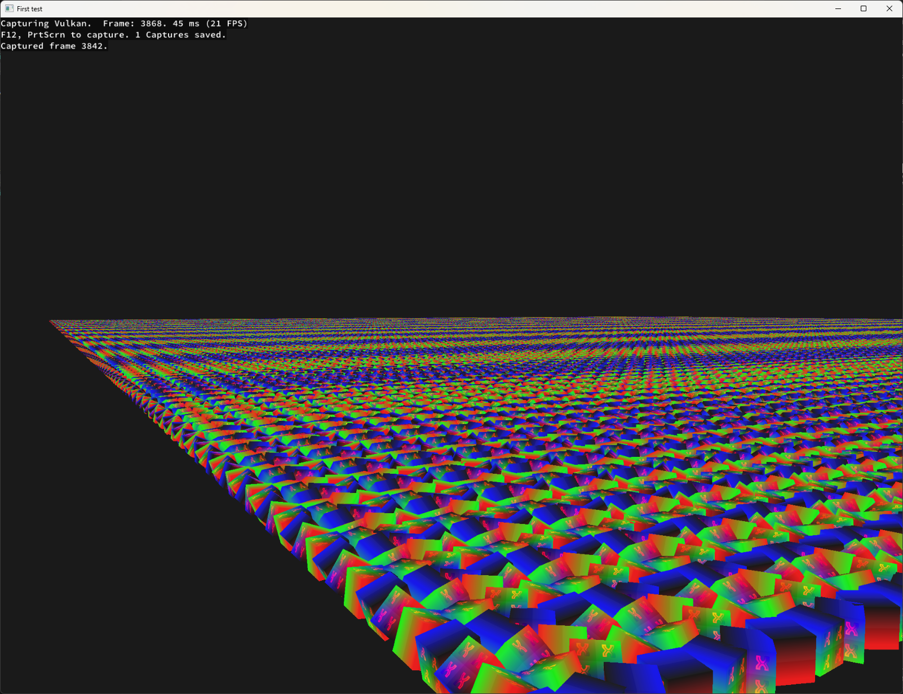
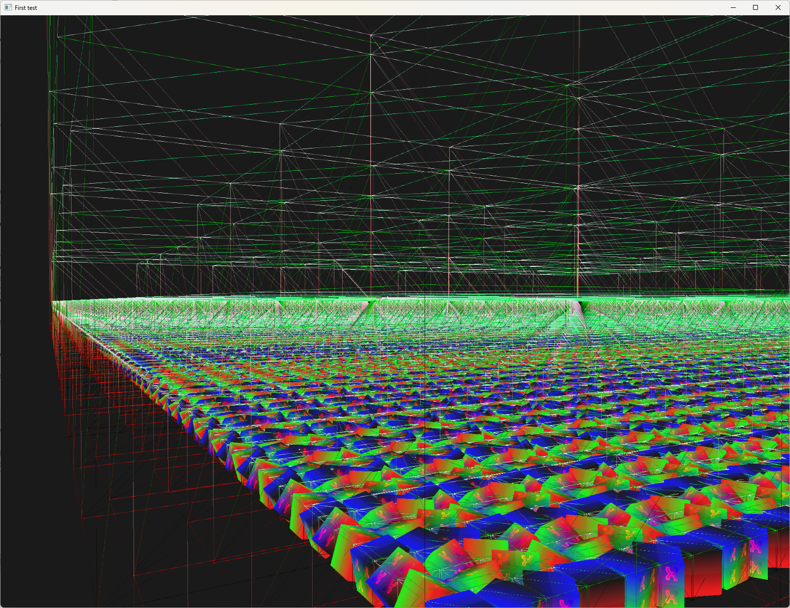

# Ajiva Vulcan Engine [](https://github.com/xuri02/ajiva/actions/workflows/codeql-analysis.yml) [](https://github.com/xuri02/ajiva/actions/workflows/dotnet.yml)

Ajiva is a Game Engine based using Vulcan to render graphics. Its written in c# and uses the PInvoke method to call
native methods.

## Features

### Entity Component System (ECS)

The engine uses a custom Event based Entity Component System (ECS) to handle interactions between all system.
Event based means, that e.g the Transform component will fire and event on change, using the IChangingObserver, the render
system can react to this and update the Uniform Buffer.

### Dependency Injection

Migrated to [Autofac](https://github.com/autofac/Autofac) for Dependency Injection.
In older versions the ECS was used to inject dependencies, but this made it overcomplicated and hard to maintain lifetimes for the dependencies, witch we need for later Scene loading / unloading.

### Entitys

Entitys are generated by a [Source Generator](https://learn.microsoft.com/en-us/dotnet/csharp/roslyn-sdk/source-generators-overview) ([Ajiva.Generator](src/Ajiva.Generator)).
This works by Tagging a class with the [EntityComponent] Attribute and parsing the class for all components as parameters.

```csharp
[EntityComponent(typeof(Transform3d))]
public sealed partial class FpsCamera : IUpdate, IDisposable { ... }
```

The Generator will then generate a partial class implementing the IEntity interface and adding the components as properties.
Additionally the Generator will generate a Factory class for each Entity, with a fluent interface to configure the Entity.

<details>
  <summary>Code</summary>

```csharp
public partial class FpsCamera : IEntity
{
    public Guid Id { get; } = Guid.NewGuid();
    public Transform3d Transform3d { get; protected set; }
    public bool TryGetComponent<TComponent>([MaybeNullWhen(false)] out TComponent value) where TComponent : IComponent { ... }
    public bool HasComponent<TComponent>() where TComponent : IComponent { ... }
    public TComponent Get<TComponent>() where TComponent : IComponent { ... }
    public FpsCamera Configure<TComponent>(Action<TComponent> configuration) where TComponent : IComponent { ... }
    public IEnumerable<IComponent> GetComponents() { ... }
    public IEnumerable<Type> GetComponentTypes() { ... }
    protected FpsCamera() {}
    internal static FpsCamera CreateEmpty() { return new(); }
}

public ref struct Creator {
    public FpsCameraFactoryData FactoryData;
    public Transform3d? Transform3d;
    public FpsCamera Create() { ... }
    public FpsCamera Finalize() { ... }
    public FpsCamera.Creator With(Transform3d val) { Transform3d = val; return this; }
}
public partial record FpsCameraFactoryData(IComponentSystem<Transform3d> Transform3d, IEntityRegistry EntityRegistry) : FactoryData {
        public FpsCamera.Creator Begin() => new() { FactoryData = this };
}
```

</details>

Last of all the Generator will generate a Extension for Autofac to register Factory in DI.
The usage of the Factory is as follows:

```csharp
var factory = this.container.Resolve<EntityFactory>() // get universal factory
var cube = factory.CreateCube()
    .With(new Transform3d {
        Position = Vector3.Zero,
        Rotation = Vector3.Zero,
        Scale = Vector3.One
    })
    .Finalize() // creates the Entity with all Specified Components all not specified Components will be resolved using autofac from corresponding ComponentSystems
    .Configure<CollisionsComponent>(c => c.MeshId = MeshPrefab.Cube.MeshId)
    .Configure<PhysicsComponent>(p => p.IsStatic = true);
```

### Bounding Boxes / Spatial Partitioning

Bounding Boxes are a Component that listens for updates on the Transform Component and updates the Bounding Box accordingly using a custom WorkerPool.
The Updated Bounding Box is stored in a Dynamic Octal Tree, witch is used for Spatial Partitioning.

The Dynamic Octal Tree is a custom implementation of a Octal Tree, witch is used to store the Bounding Boxes of all Entitys. It Dynamically Expands if a Entitys Bounding Box dose not lie within the current bounds of the Tree. This reduces the maximum depth of the Tree, but keeps all Entitys in leaf nodes beyond the maximum depth.

The Dynamic Octal Tree supports a debug visualization, witch pools debug boxes for each node and renders using the debug Bounding box Layer.

<details>
  <summary>Image</summary>


</details>

### Renderer

Overengineered Renderer, supports LayerSystems as `Ajiva3dLayerSystem` and `Ajiva2dLayerSystem` witch are used to render 3d and 2d Layers respectively. Currently we have `SolidMeshRenderLayer` and `DebugLayer` as 3d Layers and `Mesh2dRenderLayer` as 2d Layer. These Layers are Combined in the `AjivaLayerRenderer` 'blends' (color.w < .1) the output of the Layers together.

The 3d Renders use Instancing to render multiple Meshes at different positions in one draw call.


<details>
  <summary>Debug</summary>


</details>


## Dependencies

[Dependency graph](https://github.com/xuri-ajiva/ajiva-vulcan/network/dependencies)

Located in [libs](libs) are some adjusted libraries

| name     | Description                                   | Author                                                |
| :------- | :-------------------------------------------- | :---------------------------------------------------- |
| SharpVk  | C#/.NET Bindings for the Vulkan API           | [Andrew Armstrong](https://github.com/FacticiusVir)   |
| Autofac  | Dependency Injection Container                | [Autofac](https://github.com/autofac/Autofac)         |
| Serilog  | Logging                                       | [Serilog](https://github.com/serilog/serilog)         |

## Credits

This core is Inspired / Base On:

- FacticiusVir/[SharpVk-Samples](https://github.com/FacticiusVir/SharpVk-Samples)
- Pilzschaf/[OpenGLTutorial](https://github.com/Pilzschaf/OpenGLTutorial)
- OneLoneCoder/[Javidx9](https://github.com/OneLoneCoder/Javidx9/blob/master/PixelGameEngine/SmallerProjects/OneLoneCoder_PGE_QuadTree1.cpp)
- [Vulkan Tutorial.com](https://vulkan-tutorial.com/)
